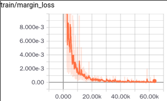
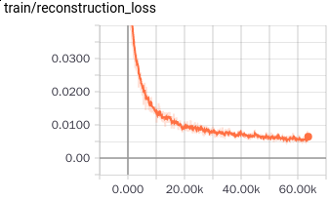

# CapsNet-Tensorflow

[](CONTRIBUTING.md)
[](https://opensource.org/licenses/Apache-2.0)

[](https://gitter.im/CapsNet-Tensorflow/Lobby)

A Tensorflow implementation of CapsNet based on Geoffrey Hinton's paper [Dynamic Routing Between Capsules](https://arxiv.org/abs/1710.09829)

> **Status:**
> 1. The capsule of MNIST version is finished. Now we have two version:
>    a) tag v0.1, not work well due to Issue #8; 
>    b) the current version, see the detailed results [here](#Results)

> **Daily task**
> 1. multi-GPU support
> 2. Improving the reusability of ``capsLayer.py``, what you need is ``import capsLayer.fully_connected`` or ``import capsLayer.conv2d`` in your code

> **Others**
> 1. [Here(知乎)](https://zhihu.com/question/67287444/answer/251460831) is an answer explaining my understanding of Section 4 of the paper (the core part of CapsNet). It may be helpful in understanding the code.
> 2. If you find out any problems, please let me know. I will try my best to 'kill' it ASAP.


## Requirements
- Python
- NumPy
- [Tensorflow](https://github.com/tensorflow/tensorflow) (I'm using 1.3.0, not yet tested for older version)
- tqdm (for displaying training progress info)
- scipy (for saving images)

## Usage
**Step 1.** 
Clone this repository with ``git``.

```
$ git clone https://github.com/naturomics/CapsNet-Tensorflow.git
$ cd CapsNet-Tensorflow
```

**Step 2.** 
Download the [MNIST dataset](http://yann.lecun.com/exdb/mnist/), ``mv`` and extract it into ``data/mnist`` directory.(Be careful the backslash appeared around the curly braces when you copy the ``wget `` command to your terminal, remove it)

```
$ mkdir -p data/mnist
$ wget -c -P data/mnist http://yann.lecun.com/exdb/mnist/{train-images-idx3-ubyte.gz,train-labels-idx1-ubyte.gz,t10k-images-idx3-ubyte.gz,t10k-labels-idx1-ubyte.gz}
$ gunzip data/mnist/*.gz
```

**Step 3.** 
Start the training:
```
$ pip install tqdm  # install it if you haven't installed yet
$ python main.py
```

> The default parameters of batch size is 128, and epoch is 50. You may need to modify the ``config.py`` file or use command line parameters to suit your case. In my case, I run ``python main.py  --test_sum_freq=200 --batch_size=48`` for my 4G GPU(~10min/epoch)

## Results

- training loss





- test acc


> My simple comments for capsule
> 1. A new version neural unit(vector in vector out, not scalar in scalar out)
> 2. The routing algorithm is similar to attention mechanism
> 3. Anyway, a great potential work, a lot to be built upon

------------
### TODO:
- Finish the MNIST version of capsNet (progress:90%)
- Do some different experiments for capsNet:
  * Try Using other datasets
  * Adjusting the model structure
 
- There is [another new paper](https://openreview.net/pdf?id=HJWLfGWRb) about capsules(submitted to ICLR 2018), a follow-up of the CapsNet paper.

## My weChat:
 
 

- Our WeChat group is growing fast, and [@nb312](https://github.com/nb312) is helping me with the wechat request. The left one is my wechat QR, but if you just want to join our group, please contact [@nb312](https://github.com/nb312) by the QR in the right side.


### Reference
- [XifengGuo/CapsNet-Keras](https://github.com/XifengGuo/CapsNet-Keras): referred for code optimization
